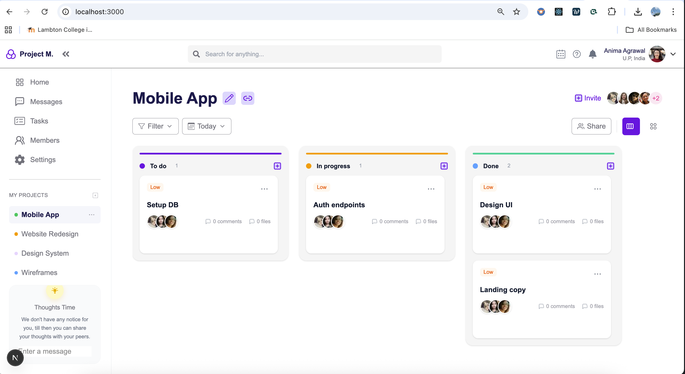
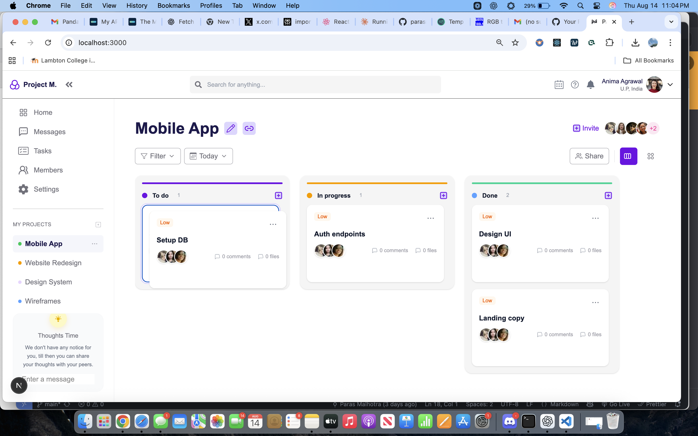

# 🗂️ Kanban Board

A modern, responsive Kanban Board built with **Next.js**, **TypeScript**, **TailwindCSS**, **Redux Toolkit**, and **dnd-kit** for smooth drag-and-drop interactions.
This app allows you to visually manage tasks by organizing them into columns such as **To Do**, **In Progress**, and **Done**.
Cards can be reordered within a column or moved across columns — all with smooth animations and mobile-friendly layouts.

---

## Screenshots

| Home Screen | Drag & Drop Section |
|------------|-------------------|
|  |  |


-- [Live Demo] : (https://kanban-board-hzecm0u7v-parasmalhotra522-gmailcoms-projects.vercel.app/)

---

## Features
Drag & Drop with **@dnd-kit/core**
Move cards between columns or reorder within the same column.
**Redux Toolkit** for predictable state management.
**Responsive UI** using TailwindCSS (desktop & mobile ready).
**Customizable Columns** — easily adjust in kanbanSlice.
**Card Details**:
Priority tags: Low, Medium, High, Completed
Optional description
Team member avatars
Comment & file counters
**Smooth Animations** when dragging & dropping.
**Persistent State** (using Redux for persisting the state of the application.).


## 🚀 Prerequisites
- Node.js (v14 or higher)
- npm or yarn

---

## 🛠️ Tech Stack

- **Framework:** [Next.js](https://nextjs.org/) (App Router)
- **Language:** [TypeScript](https://www.typescriptlang.org/)
- **Styling:** [Tailwind CSS](https://tailwindcss.com/)
- **State Management:** [Redux Toolkit](https://redux-toolkit.js.org/)
- **Drag & Drop:** [dnd-kit](https://docs.dndkit.com/)
- **Icons:** [React Icons](https://react-icons.github.io/react-icons/)
- **Images:** [next/image](https://nextjs.org/docs/pages/api-reference/components/image)

---

## 📦 Installation & Setup

```bash

# 1️⃣ Clone the repository
git clone https://github.com/parasmalhotra522/kanbanBoard.git

# 2️⃣ Navigate into the folder
cd kanban-board

# 3️⃣ Install dependencies
npm install
# or
yarn install

# 4️⃣ Start the development server
npm run dev
# or
yarn dev


